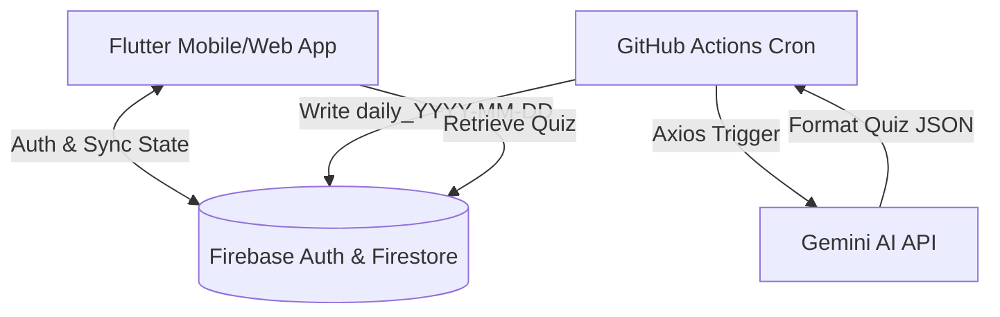

# City of Wealth 💎

A premium, interactive personal finance simulation game designed to teach real-world financial literacy through active gameplay. Built with a modern cross-platform **Flutter** frontend, backed by **Firebase Auth & Firestore**, and powered by an automated **Gemini AI** quiz generation pipeline running on **GitHub Actions**.

---

## 🏛️ System Architecture



---

## 🛠️ Tech Stack & Key Technologies

### 📱 Frontend / Client
- **Framework & Language**: Flutter (Dart SDK `^3.9.2`).
- **Visuals & UI**: Custom-built **Isometric Grid Render Engine** utilizing centered grid-to-offset coordinate translation to place building structures.
- **State Management**: Centralized `GameManager` (built on Flutter's native `ChangeNotifier`), driving the 5-second tick game loop (day cycles, taxes, interest, passive income accumulation, and bankruptcy checks).
- **Offline Persistence**: Local storage caching powered by `shared_preferences` to allow seamless offline play before syncing with the cloud.
- **Local Notifications & Background Tasks**: Configured with `flutter_local_notifications` and `workmanager` for daily challenge reminders and streak notifications.
- **Audio Engine**: Powered by `audioplayers` with dedicated `MusicManager` and `SfxManager` supporting independent volume sliders and a custom `SfxNavigatorObserver` to automatically trigger UI sounds on page transitions.

### ☁️ Cloud & Backend
- **Firebase Authentication**: Email/Password signups and Google Sign-In integrations (`google_sign_in`).
- **Cloud Firestore**:
  - **Progress Sync**: Stores user metrics, inventory, building coordinates, active disaster status, and streak configurations in the `players` collection. On login, the client performs a timestamp-comparison merge protocol (local vs. cloud `lastUpdated` timestamp) to prevent state overwriting.
  - **Daily Quiz Repository**: Serves daily challenges to users and maintains a history of past quizzes (last 30 days) to enable "Practice Mode" for players.

### 🤖 Quiz Generation Pipeline (Gemini AI & GitHub Actions)
- **GitHub Workflow**: An automated cron job defined in `.github/workflows/daily-question.yml` runs daily at **18:30 UTC / 00:00 IST** (`30 18 * * *`).
- **Topic De-duplication**: The Node.js worker script (`scripts/daily_quiz_generator.js`) reads the last 30 daily quiz records from Cloud Firestore. It compiles their titles, questions, and answers to inject into the AI system prompt, ensuring the generated content is unique.
- **Dynamic AI Generation**: Calls Google's **Gemini AI API (`gemini-2.0-flash`)** using a detailed prompt. Gemini acts as a financial analyst, producing a new multiple-choice question, options, correct options, and extensive correct/incorrect answers explanations.
- **Automated Validation**: Parses the raw JSON response from Gemini, injects metadata (such as the target IST date and required level), and writes the document directly to the Firestore `daily_quizzes` collection.

---

## 📁 Repository Structure

```text
├── .github/workflows/
│   └── daily-question.yml        # GitHub Actions configuration for daily quiz generation
├── assets/
│   └── app_icon.png              # Launcher Icon
├── lib/
│   ├── assets/                   # Fonts, music, sound effects, and building sprites
│   ├── data/
│   │   └── notification_data.dart # Templates and variations for scheduled notification messages
│   ├── logic/
│   │   └── tutorial_keys.dart    # GlobalKeys used for spotlight tutorial overlays
│   ├── services/
│   │   ├── auth_service.dart      # Interface for Firebase Auth and Google Sign-In
│   │   ├── firestore_service.dart # Handles cloud saves, progress loads, and quiz fetching
│   │   ├── music_manager.dart     # Handles background music loops
│   │   ├── sfx_manager.dart       # Handles UI and event sound effects
│   │   └── notification_service.dart # Notification scheduling, permissions, and workmanager hooks
│   ├── screens/                  # Game screens (Assets, Liabilities, Passive Income, Login, Quiz)
│   ├── widgets/                  # Isometric board renderer, custom overlays, and custom dialogs
│   ├── game_state.dart           # Central state manager (GameManager), holds core business logic
│   └── main.dart                 # Application entry point & service initialization
├── scripts/
│   ├── daily_quiz_generator.js   # Node.js backend cron script for quiz generation
│   └── package.json              # Package manifest for quiz generation dependencies
├── user_manual.txt               # In-depth mechanics reference manual
└── pubspec.yaml                  # Flutter package dependency configuration
```

---

## 🚀 Getting Started (Developer Setup)

### Prerequisites
- [Flutter SDK](https://docs.flutter.dev/get-started/install) (v3.19+ recommended)
- [Node.js](https://nodejs.org/) (v20+ recommended, for executing utility/automation scripts)
- Firebase CLI (for setting up new Firebase projects)

---

### Client App Installation

1. **Clone the Repo**:
   ```bash
   git clone https://github.com/bopcello/City-of-Wealth-new.git
   cd city_of_wealth
   ```

2. **Configure Firebase**:
   Ensure you have a Firebase project with **Authentication** (Email + Google providers) and **Firestore** enabled. Generate your configuration file:
   ```bash
   flutterfire configure
   ```
   This will create `lib/firebase_options.dart`.

3. **Install Dependencies**:
   ```bash
   flutter pub get
   ```

4. **Run the App**:
   - For Android/iOS: Ensure a simulator or physical device is connected, and run:
     ```bash
     flutter run
     ```
   - For Web development:
     ```bash
     flutter run -d chrome
     ```

---

### Testing the Quiz Generator Locally

If you want to debug or test the quiz generator script:

1. **Navigate to the Scripts Directory**:
   ```bash
   cd scripts
   ```

2. **Install Node.js Packages**:
   ```bash
   npm install
   ```

3. **Acquire Credentials**:
   - Generate a Service Account JSON in the Firebase Console: **Project Settings > Service Accounts**. Download the key file.
   - Obtain a Gemini API Key from Google AI Studio.

4. **Export Environment Variables**:
   *On Windows (PowerShell):*
   ```powershell
   $env:FIREBASE_SERVICE_ACCOUNT = Get-Content -Raw "path/to/your/firebase-service-account.json"
   $env:GEMINI_API_KEY = "your-gemini-api-key"
   ```
   *On macOS/Linux:*
   ```bash
   export FIREBASE_SERVICE_ACCOUNT=$(cat path/to/your/firebase-service-account.json)
   export GEMINI_API_KEY="your-gemini-api-key"
   ```

5. **Run the Generator Script**:
   ```bash
   node daily_quiz_generator.js
   ```
   This will simulate the GitHub Actions workflow, query Firestore for recent questions, fetch a new quiz from Gemini, and save it under the collection `daily_quizzes` with the document ID `daily_YYYY-MM-DD` (IST timezone).

---

## 🎮 Core Game Mechanics & Educational Principles

City of Wealth translates crucial personal finance concepts into game mechanics:

### 1. Career Tracks (Salary vs. Equity)
- **Job Track**: Represents stable career growth. Levels: *Student (20 Gems)* ➡️ *Employee (40 Gems)* ➡️ *Supervisor (80 Gems)* ➡️ *Manager (160 Gems)* ➡️ *CEO (400 Gems)*.
- **Business Track**: High growth potential but higher capital requirement. Levels: *Student (20 Gems)* ➡️ *Idea (50 Gems)* ➡️ *Bootstrap (100 Gems)* ➡️ *Funded (250 Gems)* ➡️ *Unicorn (600 Gems)*.
- *Lesson*: Demonstrates the trade-off between stable salaries and high-risk entrepreneurial ventures.

### 2. Gems (Cash Flow) & KP (Wisdom & Standing)
- **Gems** represent liquid bank balance, spent on assets, daily life choices, and investments.
- **Knowledge Points (KP)** represents financial IQ. It serves as a requirement to level up.
- *Lesson*: Money and financial intelligence must grow together. Accumulating cash without intelligence leads to bad habits, penalties, or bankruptcy.

### 3. Daily Living Choices & Lifestyle Creep
Every cycle, players decide their Rent, Food, and Transport choices.
- **Frugal choices** save money but stunt KP growth as productivity falls.
- **Luxury choices** increase KP but drain cash reserves. Choosing high-end luxury options too early (like a Luxury House as a Student) yields severe KP penalties.
- *Lesson*: Illustrates lifestyle inflation. Financial decisions are context-dependent; a reasonable expenditure for a Manager can be financial ruin for a Student.

### 4. Overtime & Asset Penalties (Burnout & Waste)
- **Overtime Work**: Generates quick income but reduces KP. Doing overtime for >10 consecutive cycles triggers a severe **1000 KP Burnout Penalty**.
- **Waste Asset Penalty**: Owning physical assets beyond what your career level can maintain results in a `-50 to -100 KP` waste penalty per cycle.
- *Lesson*: Teaches that extreme grinding is unsustainable, and hoarding unproductive/unused assets ties up capital and incurs upkeep costs.

### 5. Debt, Interest & Bankruptcy
- If Gem balance dips below zero, interest is charged every cycle (5% scaling up to 20% for debt > 2000 Gems), alongside a `-200 KP` penalty.
- Remaining in debt for >30 cycles triggers foreclosure, destroying placement buildings.
- **Bankruptcy**: Clears debt but resets player level back to Level 1, liquidating all buildings/assets at an 80% loss.
- *Lesson*: Simulates the real-world spiral of high-interest debt and the severe long-term impact of bankruptcy.

### 6. Passive Income (Investment Assets)
Players convert idle physical assets into active investment units:
- **Farm** (Land): Setup cost 80 Gems ➡️ Yields 10 Gems/cycle.
- **Factory** (Machinery): Setup cost 150 Gems ➡️ Yields 12 Gems/cycle.
- **Apartment** (Buildings): Setup cost 400 Gems ➡️ Yields 50 Gems/cycle.
- **Distribution Center** (Vehicles): Setup cost 250 Gems ➡️ Yields 35 Gems/cycle.
- **IT Service Center** (Office Equipment): Setup cost 120 Gems ➡️ Yields 20 Gems/cycle.
- *Lesson*: Illustrates how capital investment transforms assets into active cash-flowing assets.

### 7. Streak Rewards & Emergency Revivals
- **Streak Rewards**: Earned by attempting (no need to answer correctly) the Daily Quiz. Tier 10+ days (Regular Customer, 5% asset discount), Tier 30+ days (Consistency Master, 5% discount + 5% passive income boost), Tier 100+ days (Master of Money, 10% discount + 5% passive income boost).
- **Revivals**: Stored as an emergency fund (1 revival per 10 streak days, max 5). Automatically consumed to preserve a streak if a day is missed.
- *Lesson*: Teaches consistency over market timing, and how an emergency fund buffer saves you from losing accumulated progress.

### 8. Disasters, Insurance & Asset Diversification
Every 15-19 cycles, a random disaster strikes.
- **Asset Disasters** (Floods, Fires, Earthquakes) destroy up to 50% of specific physical asset classes. Without Insurance (costs 5 Gems/cycle), assets are lost permanently. With Insurance, players receive an 80% cost payout.
- **Passive Income Disasters** (Droughts, Landslides, Crashes, Mass Emigration, Pandemics) reduce passive income yields by 60%-90% for 20 cycles, with a 20% chance to permanently deactivate a building.
- *Lesson*: Simulates unexpected life emergencies, illustrating the need for insurance risk mitigation and asset diversification to avoid single points of failure.
